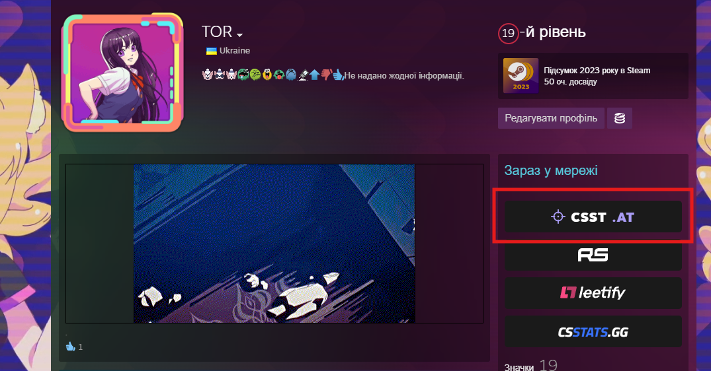
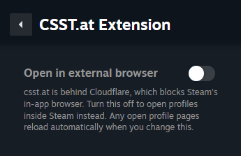

# CSST.at Extension for Millennium

A [Millennium](https://steambrew.app/) plugin that injects a **csst.at** profile button into
Steam community profile pages. The button links to `https://csst.at/profile/{steamId64}`.

[csst.at](https://csst.at/) is a CS2 player-stats aggregator that compares Steam, Faceit,
Leetify, and csstats.gg stats on a single page.

### Example



### Millennium Library Manager


## 📋 Prerequisites

- **[Millennium](https://steambrew.app/)** installed and configured

## 🚀 Installation

### Build from Source

```bash
git clone https://github.com/TOR968/csst-at-extension.git
cd csst-at-extension

bun install      # install dependencies
bun run build    # production build  (or `bun run dev` for development)
```

Then copy the plugin into the Millennium plugins directory:

```bash
# Windows
copy /R . "C:\Program Files (x86)\Steam\millennium\plugins\csst-at-extension"

# Linux
cp -r . ~/.local/share/millennium/plugins/csst-at-extension

# macOS
cp -r . ~/Library/Application\ Support/millennium/plugins/csst-at-extension
```

Restart Steam, then enable **CSST.at Extension** under **Millennium → Plugins** and restart once more.

## 🛠️ Development

```bash
bun run dev      # one-shot dev build
bun run watch    # rebuild on file changes
bun run build    # production build
```

There are no automated tests. To type-check:

```bash
npx tsc -p frontend/tsconfig.json --noEmit
```

## 🔗 Links

- [Millennium Framework](https://github.com/SteamClientHomebrew/Millennium)
- [csst.at](https://csst.at)
- [Steam Client](https://store.steampowered.com/about/)
